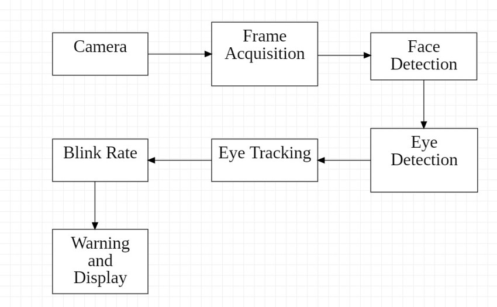
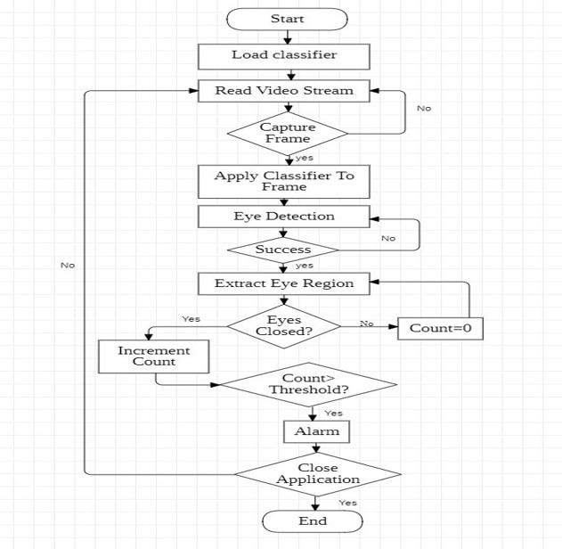
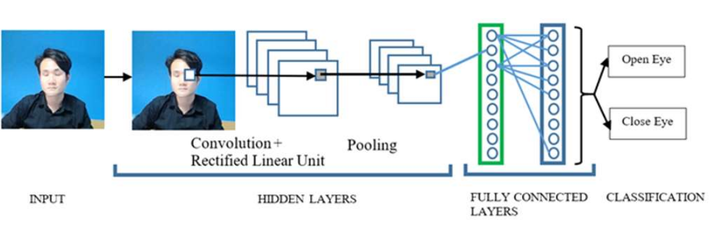
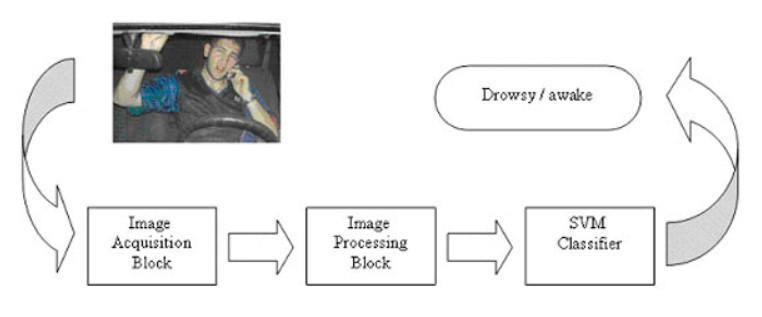
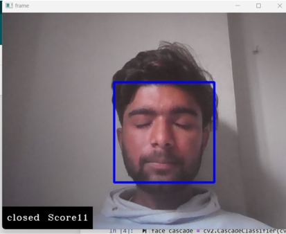
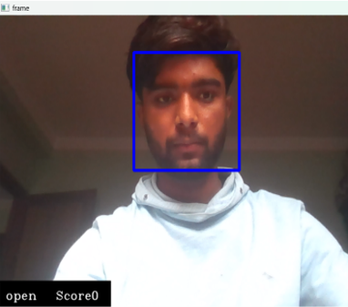
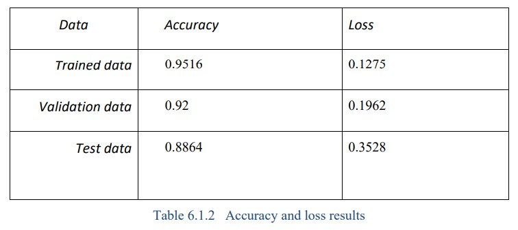
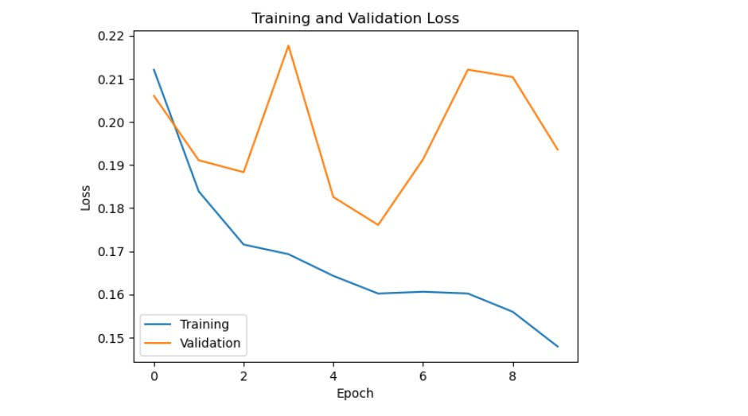

# Drowsiness Detection
## Comparison of CNN and SVM Algorithms for Real-time Drowsiness Detection

## Overview
Driver drowsiness detection is crucial for improving road safety by preventing accidents caused by tired or inattentive drivers. Research indicates that drowsy driving has impairing effects on attention and reaction times comparable to those of driving under the influence of alcohol. Consequently, effective systems for monitoring and detecting drowsiness are essential for enhancing driver safety and reducing traffic incidents.

## Abstract
This project addresses the critical issue of drowsy driving— a leading cause of road accidents—by implementing a system that employs machine learning algorithms, specifically Convolutional Neural Networks (CNN) and Support Vector Machines (SVM), to detect driver drowsiness. The system analyzes the diameter of the driver’s eyes to identify drowsy states. In the U.S., approximately 100,000 drowsy driving-related collisions occur annually, resulting in over 1,550 fatalities and 71,000 injuries. This solution aims to alert drivers of their drowsiness, thereby reducing accidents.

The effectiveness of CNN and SVM algorithms was evaluated using a large dataset of images depicting both drowsy and alert drivers, enabling real-time identification of the driver’s state. The system is envisioned as a reliable and cost-effective measure to combat drowsy driving, with potential applications in the automotive industry. Continued research and development may facilitate its widespread implementation.

## Introduction
Driver drowsiness is a significant road safety concern, contributing to many accidents worldwide. Drowsy drivers suffer from impaired cognitive functions, reduced reaction times, and decreased awareness—similar to the effects of alcohol impairment. This project explores the comparison between two prominent machine learning approaches for detecting driver drowsiness: Convolutional Neural Networks (CNN) and Support Vector Machines (SVM).

CNNs are deep learning models designed for visual data analysis, making them particularly effective for processing images of drivers’ faces to identify signs of drowsiness, such as eye closure and facial expressions. In contrast, SVM is a traditional machine learning algorithm that excels in classification tasks by relying on feature extraction techniques to differentiate between alert and drowsy states.

By evaluating the performance of CNN and SVM in driver drowsiness detection, this project aims to identify the strengths and limitations of each approach, ultimately providing insights into the most effective methods for real-time monitoring and alerting systems. The findings may contribute to developing more reliable driver assistance systems, enhancing road safety for all.

*Figure 1: Drowsy Driver - An example image illustrating the characteristics of driver drowsiness.*
*Copyright © 2024 Nauto. All rights reserved.*

## Project Objective
To develop a real-time driver drowsiness detection system using Convolutional Neural Networks (CNN) and Support Vector Machines (SVM), comparing their effectiveness in accurately identifying drowsy states. The goal is to enhance driver safety by providing alerts and to create a cost-effective solution for automotive integration.

## System Design

*Figure 2: Overall System Design*

## Methodology

*Figure 3: System Methodology/Flowchart*

## Architecture
### Convolutional Neural Network(CNN)

*Figure 4: CNN Architecture*
*Source: Appropedia *

For the Drowsiness Detection project, we employed a Convolutional Neural Network (CNN) architecture utilizing the pre-trained InceptionV3 model as a backbone. The InceptionV3 model is known for its depth and ability to extract rich feature representations from images.

#### Implementation Details:
- **Base Model:** InceptionV3 (pre-trained on ImageNet)
  - This model was loaded without the top classification layer, allowing us to fine-tune it for our specific task.
- **Input Layer:** The input size was set to (80, 80, 3) to accommodate color images of drivers.
- **Output Layer:**
  - The CNN output is flattened and followed by a dense layer with 64 units and ReLU activation, which captures essential features.
  - A Dropout layer with a rate of 0.5 is included to prevent overfitting.
  - The final output layer uses softmax activation to classify the driver state into two categories: drowsy and alert.

#### Data Augmentation:
To enhance model robustness, we utilized image data augmentation techniques such as rotation, shear, zoom, and shifts during the training process.

#### Training:
The model was compiled using the Adam optimizer and categorical cross-entropy loss. We tracked the training process with callbacks for early stopping and model checkpointing to ensure the best model was saved during training.

This architecture leverages transfer learning, allowing for efficient training with limited data while benefiting from the extensive knowledge captured in the pre-trained model.

### Support vector machine(SVM)

*Figure 5: SVM Architecture*
*Source: eelabs*

The Support Vector Machine (SVM) is a powerful supervised machine learning algorithm commonly used for classification tasks. In this project, we employed SVM for detecting driver drowsiness by analyzing the features extracted from the images of drivers' faces.

#### Implementation Details:
- **Feature Extraction:**
  - Prior to SVM classification, we utilized image processing techniques to extract relevant features from the input images. Key features included eye aspect ratio, diameter of the eyes, and other facial landmarks that indicate drowsiness.
- **Kernel Function:**
  - We selected a Radial Basis Function (RBF) kernel for the SVM, which is effective for non-linear classification tasks. The RBF kernel helps in mapping the input features into a higher-dimensional space, allowing the SVM to find a hyperplane that optimally separates the classes (drowsy and alert).
- **Training:**
  - The SVM model was trained on a dataset containing features extracted from images of both drowsy and alert drivers. The dataset was split into training and testing sets to evaluate the model's performance effectively.

## Datasets
For this project, we utilized the MRL Eye Dataset, a comprehensive collection of human eye images specifically designed for tasks such as eye detection, gaze estimation, and eye-blinking frequency analysis. This dataset is particularly valuable in the context of driver behavior studies, as it includes a significant amount of testing data acquired under real-world conditions.

Below are sample images from the MRL Eye Dataset:

| Open Eye Image 1 | Open Eye Image 2 |
|-------------------|-------------------|
|  |  |
| Closed Eye Image 1 | Closed Eye Image 2 |
|  |  |

#### Dataset Details:
- **Content:**
  - The MRL Eye Dataset comprises a total of **84,898 infrared images** captured in various lighting conditions and using different devices. 
- **Resolution:**
  - The images are available in both low and high resolution, allowing for flexible experimentation and model training.
- **Categories:**
  - To facilitate algorithm comparison, the dataset is organized into several categories, making it suitable for training and testing various classifiers.

#### Annotations:
The dataset includes annotations for approximately **15,000 pupil points** across the images, with the following properties indicated:
- **Subject ID:** Data collected from **37 individuals** (33 men and 4 women).
- **Image ID:** Total of **84,898 images**.
- **Gender:** Annotated as [0 - man, 1 - woman] for each image.
- **Glasses:** Indicated as [0 - no, 1 - yes] to show if the eye image contains glasses.
- **Eye State:** Classified as [0 - closed, 1 - open] for the state of the eyes.
- **Reflections:** Annotated as [0 - none, 1 - small, 2 - big] based on the size of reflections in the images.
- **Lighting Conditions:** Categorized as [0 - bad, 1 - good] based on the lighting during image capture.
- **Sensor ID:** Captured using three different sensors:
  - **01 - RealSense:** Intel RealSense RS 300 sensor with 640 x 480 resolution.
  - **02 - IDS:** IDS Imaging sensor with 1280 x 1024 resolution.
  - **03 - Aptina:** Aptina sensor with 752 x 480 resolution.

#### Availability:
The MRL Eye Dataset is publicly available for download [here](http://mrl.cs.vsb.cz/eyedataset). The annotations for the pupil points can be downloaded [here](http://mrl.cs.vsb.cz/data/eyedataset/pupil.txt). For further details about the dataset, refer to the paper titled "Pupil localization using geodesic distance." For any questions regarding the dataset, please contact **Radovan Fusek**.
### Dataset split
Datasets were split in 80% and 

## Output

  

    
  

  

    
  

*Figure: Output for open eye and closed eye*

## Results and Conclusion

The results indicate that the CNN model excelled in training, achieving a high accuracy of **95.16%** on the training dataset and **92%** on the validation dataset. However, the model's performance on the test dataset was slightly lower at **88.64%**, indicating a potential overfitting issue during training.

In contrast, the Support Vector Machine (SVM) algorithm achieved a remarkable accuracy of **97%** on the same limited dataset. This demonstrates that the SVM outperformed the CNN in terms of overall accuracy, particularly in scenarios where the dataset was smaller and more manageable. 

### Metrices

*Figure: Evaluation metrics of accuracy*

*Figure: Training and Validation accuracy*

*Figure: Training and Validation loss*

## Publications
- Ghimire, P., Khanal, R., Pandey, P., Dhakal, S., Bhatta, L.P. (2023). "Algorithms Comparison in Drowsiness Detection." Nepal Journals Online, Journal of Advanced College of Engineering and Management, Vol. 8, No. 2, DOI: [10.3126/jacem.v8i2.55946](https://doi.org/10.3126/jacem.v8i2.55946)

